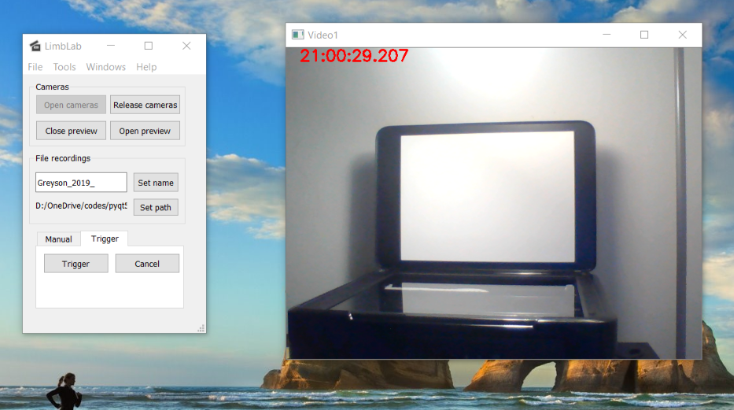

# Introduction
This is a PyQT5 program for multiple camera data streaming and recording. Right now it can support up to 4 web cameras (typically USB 2.0). The video recordings could be turned on and off by hand or by triggering pulses from the computer's serial port. Single frame triggering has not benn implemented yet.

# Required packages
PyQT5, opencv for python, serial

# It looks like this when running

# How to run this program?
1. Make sure the required packages are installed in your Python environment. (didn't make a `setup.py` here, :-() )
2. Plug your cameras in. Connect the triggering cable if you need the triggering function.
3. Clone this repo to your local machine, cd into its path, and just simply run `python MainProgram.py`